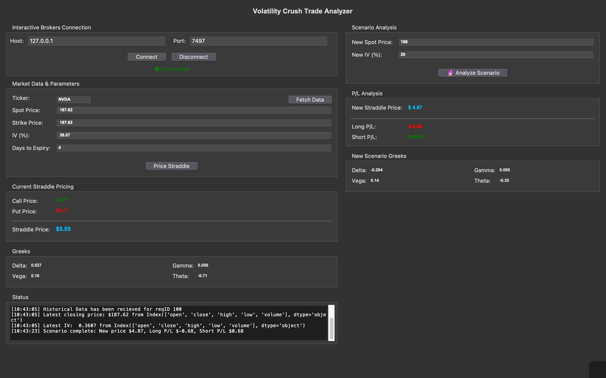

# Volatility Crush Trade Analyzer

A comprehensive desktop application for analyzing option straddle strategies with real-time market data integration through the Interactive Brokers TWS API. This tool enables traders to model volatility crush scenarios and evaluate the risk/reward profile of straddle positions before execution.



---

## Overview

The **Volatility Crush Trade Analyzer** is designed for options traders seeking to capitalize on implied volatility (IV) compression events, commonly known as “volatility crush.” This phenomenon typically occurs after earnings announcements, major economic releases, or other binary events where uncertainty dissipates rapidly, causing a sharp decline in option premiums regardless of the underlying price movement.

### What is a Straddle?

A **straddle** is an options strategy that involves simultaneously buying or selling both a call and a put option at the same strike price and expiration date.

* **Long Straddle**: Profits from large price movements in either direction; requires high realized volatility.
* **Short Straddle**: Profits from range-bound markets and volatility compression; benefits from theta decay.

This application evaluates both strategies by modeling how changes in the underlying price and implied volatility affect position profitability.

---

## Key Features

### 1. Real-Time Market Data Integration

* Connects directly to Interactive Brokers TWS/Gateway via the IB API.
* Fetches historical price data and implied volatility metrics.
* Automatically calculates current market conditions for target securities.

### 2. Black-Scholes Option Pricing

Implements the **Black-Scholes-Merton model** for European option valuation:

**Call Option Price:**

```
C = S·N(d₁) - K·e^(-r·T)·N(d₂)
```

**Put Option Price:**

```
P = K·e^(-r·T)·N(-d₂) - S·N(-d₁)
```

Where:

* `d₁ = [ln(S/K) + (r + σ²/2)·T] / (σ·√T)`
* `d₂ = d₁ - σ·√T`
* S = Current spot price
* K = Strike price
* T = Time to expiration (years)
* r = Risk-free interest rate
* σ = Implied volatility (annualized)
* N(·) = Cumulative standard normal distribution

### 3. Greeks Calculation and Risk Metrics

The application calculates standard **option Greeks** to quantify risk exposures.

#### Delta (Δ)

Measures sensitivity to underlying price changes.

* Call: `Δ_call = N(d₁)`
* Put: `Δ_put = N(d₁) - 1`
* Straddle: Approximately neutral (Δ ≈ 0 for ATM options).

#### Gamma (Γ)

Measures the rate of change in delta relative to changes in the underlying price.

```
Γ = N'(d₁) / (S·σ·√T)
```

High gamma indicates rapid changes in delta.

#### Vega (ν)

Measures sensitivity to changes in implied volatility.

```
ν = S·N'(d₁)·√T / 100
```

For straddles: `Straddle Vega = 2 × Single Option Vega`.

#### Theta (Θ)

Measures time decay as expiration approaches.

* Call: `Θ_call = [-S·N'(d₁)·σ/(2·√T) - r·K·e^(-r·T)·N(d₂)] / 365`
* Put: `Θ_put = [-S·N'(d₁)·σ/(2·√T) + r·K·e^(-r·T)·N(-d₂)] / 365`

Short straddles benefit from positive theta (time decay working in favor), while long straddles suffer from it.

### 4. Scenario Analysis Engine

Models “what-if” scenarios to evaluate the impact of volatility changes.

**Pre-Event State:**

* Spot Price: $150
* IV: 60%
* ATM Straddle Price: $12.50

**Post-Event (Volatility Crush):**

* Spot Price: $152
* IV: 35%
* Straddle Price: $7.80

**P&L:**

* Short Straddle: +$4.70 per contract
* Long Straddle: -$4.70 per contract

This demonstrates that volatility compression can dominate P&L even when the underlying moves favorably.

---

## Practical Trading Applications

### 1. Earnings Volatility Crush Strategy

A common use case involves trading earnings announcements.

**Setup:**

* IV inflates 2–3 weeks before earnings.
* Straddle premiums rise as options price in expected movement.

**Execution:**

* Sell ATM straddle the day before earnings.
* Target 30–50% IV drop post-announcement.
* Exit within 24–48 hours post-event.

**Example:**

```
Ticker: NVDA
Days to Earnings: 1
Stock: $145
IV: 75%
ATM Straddle: $15.20
Post-Earnings IV: 40%
Expected Straddle Value: $8.50
Target Profit: $6.70 per contract (≈44%)
```

### 2. Risk Management

* **Short Straddle:** Unlimited loss potential (especially on upside).
* **Long Straddle:** Maximum loss equals premium paid.
* **Break-Even Points:**

  * Upside: K + P
  * Downside: K - P
* **Position Sizing:** Risk ≤ 2–5% of total portfolio per trade.

### 3. Greek-Based Management

* **Delta:** Hedge when |Δ| > 0.30 to control directional exposure.
* **Gamma:** Avoid excessive gamma risk near expiration.
* **Vega:** 1% IV change ≈ Vega × 1 in P&L impact.
* **Theta:** Exploit positive theta in short-volatility setups.

---

## Installation

### Prerequisites

```
Interactive Brokers TWS or IB Gateway App Installed
Paper or Live IB Account
```

### Dependencies

No Installation required with UV Package Manager; just run the program (see Usage)

**Includes:**

* `tkinter` — GUI framework
* `pandas`, `numpy`, `scipy` — data and math libraries
* `ibapi` — Interactive Brokers Python API

### IB TWS Configuration

1. Open TWS/Gateway.
2. Navigate to **File → Global Configuration → API → Settings**.
3. Enable “ActiveX and Socket Clients.”
4. Set Socket Port: `7497` (paper) or `7496` (live).
5. Add `127.0.0.1` to trusted IPs.
6. Disable “Read-Only API.”
7. Navigate to **Volatility & Analytics** within IB TWS Settings
8. Ensure Volatility Units are **Daily**

---

## Usage

1. **Launch Application**

   ```
   # Need uv package manager installed (pip install uv in global environment)
   uv run main.py
   ```

2. **Connect to Interactive Brokers**

   * Host: `127.0.0.1`
   * Port: `7497` (paper)
   * Click “Connect.” Confirm green “Connected” status.

3. **Fetch Market Data**

   * Enter ticker (e.g., NVDA, TSLA, AAPL).
   * Retrieve current spot, 30-day IV, and historical prices.

4. **Configure Straddle Parameters**

   * Strike defaults to current spot (ATM).
   * Input days to expiry and IV (%).
   * Click “Price Straddle” to compute.

5. **Run Scenario Analysis**

   * Input new spot and IV.
   * Click “Analyze Scenario.”
   * Review updated P&L and Greeks.

---

## Example Workflow: NVDA Earnings Trade (Not real #s)

```
1. Fetch NVDA data: $145.50, IV: 68%
2. Set strike: $145.50 (ATM), 7 days to expiry
3. Current straddle: $16.80
4. Model scenario: spot $148.00, IV: 38%
5. New straddle: $9.20
6. Short straddle P&L: +$7.60 (45%)
```

---

## Project Structure

```
volatility-crusher/
├── src/
│   ├── ib_client.py        # IB API connection and data retrieval
│   ├── utils.py            # Black-Scholes and Greeks calculations
│   ├── exceptions.py       # Error handling
│   └── gui.py              # Main GUI application
├── main.py                 # Entry point
└── README.md               # Documentation
```

---

## Limitations and Considerations

### Model Assumptions

* European-style options only (no early exercise).
* Constant volatility until event.
* Ignores transaction costs and slippage.
* Continuous risk-free rate.
* Assumes log-normal returns distribution.


## Future Enhancements

* IV Term Structure Graphs
* Theta Decay Consideration in PnL Calculations
* Calender Spread Analysis

---

## References

* [Interactive Brokers API Documentation](https://interactivebrokers.github.io/tws-api/)

---

## Disclaimer

This application is for educational and analytical purposes only. Options trading involves substantial risk and may not be suitable for all investors. Theoretical models do not guarantee real-world performance. Always consult a qualified financial advisor before trading options. The author assumes no liability for any losses incurred.

---

**Built with:** Python, Tkinter, Interactive Brokers API, Black-Scholes-Merton Model
**Version:** 1.0.0

---